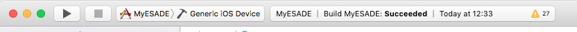

# Manual de instalación MyESADE

## Requisitos mínimos
Los requerimientos mínimos necesarios para construir la aplicación de MyESADE son los siguientes

* MacOS X 10.10
* XCode 7.x
* Homebrew 0.9 o superior
* Android SDK y sus componentes
* NodeJS 
* Apache Cordova 5.4.0

## Instalación de requisitos mínimos
### XCode 7.x
Para la instalación de XCode 7.X lo más comodo es instalarlo a través de la aplicación AppStore mediante la cuenta de iTunes. 
Si no fuera posible existe la posibilidad de bajarse el paquete de instalación desde la siguiente URL <https://developer.apple.com/xcode/download/> e instalarlo manualmente.

### Homebrew   
[Homebrew](http://brew.sh/) se trata de un gestor de paquetes para MacOS X que nos permitirá instalar el resto de dependencias más facilmente desde el Terminal. Para instalar Homebrew será necesario abrir una Terminal y ejecutar el siguiente comando:

`# /usr/bin/ruby -e "$(curl -fsSL https://raw.githubusercontent.com/Homebrew/install/master/install)"
`

### Android SDK
 
Para la instalación del SDK de Android utilizaremos la herramienta [Homebrew](#homebrew-block) desde una Terminal, ejecutaremos el siguiente comando: 

`# brew install android-sdk`

### Componentes Android
Una vez instalado el SDK de Android será necesario descargar e instalar una serie de componentes del SDK para poder construir la aplicación. Para ello utilizaremos la herramienta Android SDK Manager incluida en el SDK, desde una Terminal ejecutaremos el siguiente comando:

`# android`

Se abrirá una nueva ventana desde donde podremos seleccionar los componentes a instalar.

Los componentes que debemos seleccionar son los siguientes:

*  Tools/Android SDK Tools
*  Tools/Android SDK Platform-tools 
*  Tools/Android SDK Build-tools 23.1
*  Tools/Android SDK Tools
*  Android 5.0.1 (API 21)/SDK Platform
*  Android 5.0.1 (API 21)/Intel x86 Atom 64 System Image
*  Android 5.0.1 (API 21)/Google APIs Intel x86 Atom 64 System Image
*  Android 5.0.1 (API 21)/Google APIs
*  Extras

Pulsaremos el botón de "Install packages..." y en la pantalla siguiente aceptaremos los acuerdos de licencia y pulsaremos el botón para proceder con la instalación.

### NodeJS 
[NodeJS](https://nodejs.org) se trata de un runtime Javascript, y que proporciona además un gestor de paquetes para librerias opensource. Para su instalación recurriremos a la herramienta [Homebrew](#homebrew-block)  anteriormente instalada, desde una Terminal ejecutaremos el siguiente comando:

`# brew install node`

### Apache Cordova 5.4.0  
[Apache Cordova](https://cordova.apache.org/) se trata de un framework de desarollo para aplicaciones móviles que permite construir aplicaciones híbridas. Para su instalación recurriremos al gestor de paquetes NPM incluido en la herramienta [NodeJS](#nodejs-block) instalada en la sección anterior, desde una Terminal ejecutaremos el siguiente comando:

`# npm install -g cordova@5.4.0`

## Construcción aplicación

Una vez descargado el código desde el repositorio, nos debemos situar en el directorio con una Terminal y realizar los siguientes pasos

* Instalar dependencias del proyecto

	`# npm install`

* Instalar librerías javascript

	`# bower install`

* Inicializar el proyecto con Cordova

	`# grunt cordovaInit`
	
* Compilar el proyecto

	`# grunt build`
	
	Si solo se quiere compilar la aplicación de iOS se puede ejecutar el siguiente comando
	
	`# grunt build:local:ios`
	
	Si solo se quisiera compilar la la aplicación de iOS se puede ejecutar el siguiente comando
	
	`# grunt build:local:android`
	
## Generación binarios

### iOS
Para la generación del binario para enviar la aplicación a la AppStore seguiremos el siguiente procedimiento:

1. Abriremos el proyecto "MyESADE.xcodeproj" situado en la ruta relativa al proyecto "cordova/platforms/ios" con XCode.
2. Si no tuvieramos la cuenta de desarrollador dada de alta en XCode, la añadiremos desde las preferencias (Preferences) en la sección de cuentas (Accounts).
3. Será necesario modificar algunas configuraciones del proyecto.
	* Para el target MyESADE en la sección "General", será necesario seleccionar el equipo (Team), seleccionando nuestra cuenta de desarrollador.
	* Para el target MyESADE en la sección "Build Settings", será necesario cambiar la opción "Enable Bitcode" a "No".
4. En la barra superior modificamos el simulador seleccionado por "Generic iOS Device"

	
5. Seleccionaremos la opción de menu Product > Archive y seguiremos los pasos para subir a la App Store

### Android 
Para la generación del binario para enviar la aplicación a Google Play seguiremos el siguiente procedimiento:

1. Abrir la terminal en la ruta del proyecto
2. Ejecutar el siguiente comando

	`# grunt build:production:android`
3.  Firmar el APK generado mediante el siguiente comando (será necesario el fichero de keystore y la contraseña).

	`# jarsigner -verbose -sigalg SHA1withRSA -digestalg SHA1 -keystore MyESADEKey.keystore cordova/platforms/android/ant-build/MyESADE-release-unsigned.apk MyESADE`
	
4. Alinear el APK con el siguiente comando

	`# $ANDROID_HOME/build-tools/23.1/zipalign -v 4 cordova/platforms/android/ant-build/MyESADE-release-unsigned.apk cordova/platforms/android/ant-build/MyESADE-release-aligned.apk`
	
5. El APK final (firmado y alineado) será cordova/platforms/android/ant-build/MyESADE-release-aligned.apk

	

 
